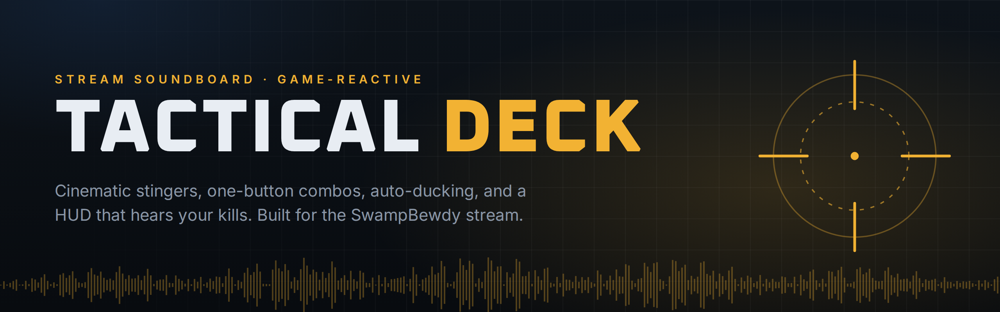
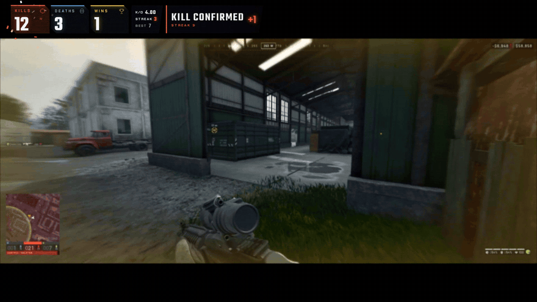
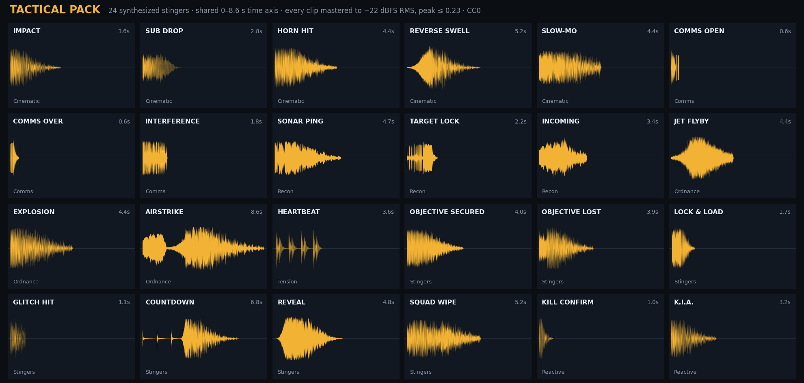
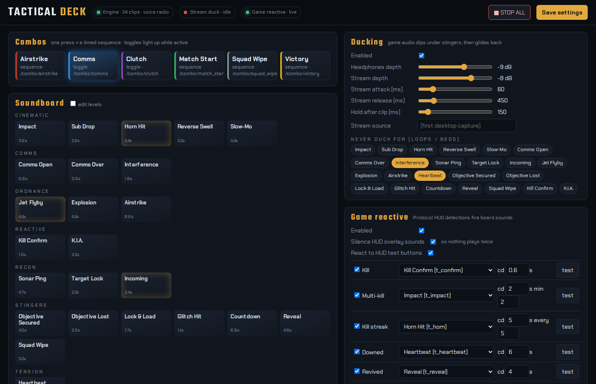
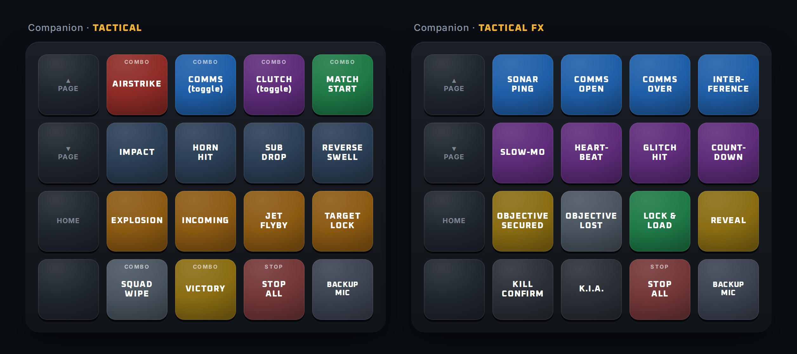
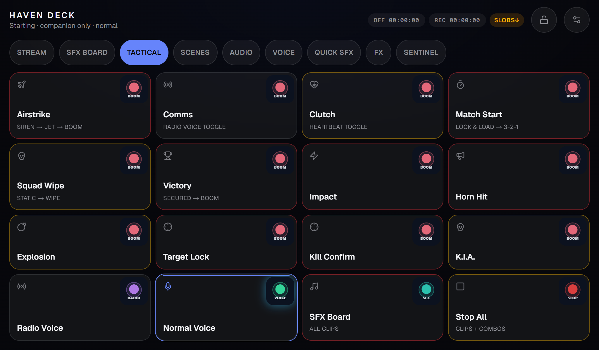
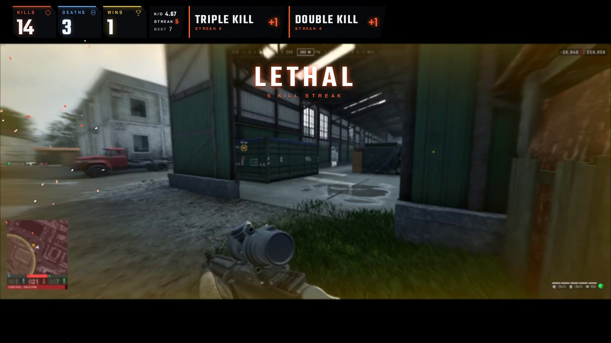
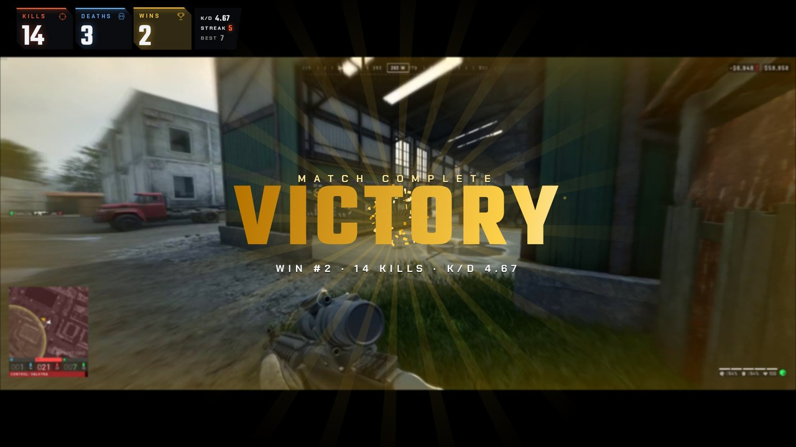
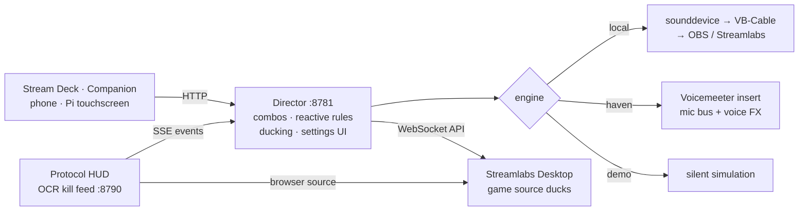

<p align="center">
  
</p>

<p align="center">
  <a href="https://github.com/RFingAdam/tactical-deck/actions/workflows/ci.yml"></a>
  
  
  <a href="LICENSE"></a>
  <a href="sounds/LICENSE"></a>
  <br>
  <a href="https://www.twitch.tv/swampbewdy"></a>
  <a href="https://www.youtube.com/@SwampBewdy"></a>
</p>

<p align="center">
  <b><a href="#-hear-it">Hear it</a></b> ·
  <b><a href="#-quick-start">Quick start</a></b> ·
  <b><a href="#-features">Features</a></b> ·
  <b><a href="#-how-it-works">How it works</a></b> ·
  <b><a href="#-http-api">HTTP API</a></b> ·
  <b><a href="#-add-your-game">Add your game</a></b>
</p>

---

Most first soundboards are an airhorn and a bruh. **Tactical Deck** is what you build after that:

- 24 cinematic, military-grade stingers, all synthesized from code. Free to use anywhere, **just credit SwampBewdy**.
- **One-button combos.** Airstrike, a radio-comms toggle, a clutch heartbeat loop.
- **Auto-ducking.** Your game audio dips under every hit and glides back.
- **A HUD that watches your kill feed** and fires the right sound before you even reach for the deck.

<p align="center">
  
  <br><sub>Protocol HUD on a real match. Three kills in a row fire TRIPLE KILL and the LETHAL streak callout; the match win fires VICTORY. Nobody pressed anything.</sub>
</p>

## 🔊 Hear it

| | |
|---|---|
| ▶️ **[Watch / listen to all 24 sounds](https://github.com/RFingAdam/tactical-deck/releases/latest/download/tactical_pack_preview.mp4)** (98 s video) | 🎧 [MP3 preview](https://github.com/RFingAdam/tactical-deck/releases/latest/download/tactical_pack_preview.mp3) |
| ⬇️ **[Download the WAV pack](https://github.com/RFingAdam/tactical-deck/releases/latest/download/tactical-pack-wav.zip)**: 48 kHz, loudness-matched, [CC BY 4.0](#-using-the-sounds). Drop it into any soundboard (Streamlabs, OBS, Voicemod, Stream Deck). No Python needed. | 🧪 Or render it yourself: `python synth/tactical_pack.py sounds/tactical` |

<p align="center"></p>

Every clip is mastered to the same loudness: **−22 dBFS RMS, peak ≤ 0.23**. No button blasts your viewers louder than the one before it, and it leaves headroom under your voice. CI checks this on every commit.

## 🚀 Quick start

**Option A: try it in 30 seconds (no audio setup, any OS)**

```bash
git clone https://github.com/RFingAdam/tactical-deck && cd tactical-deck
pip install -r requirements.txt
python director/director.py --demo --debug
# open http://127.0.0.1:8781 and press Airstrike
```

Demo mode simulates playback with each clip's real length, so you can see combos, toggles, reactive rules and the activity log working. Your settings save to `config.demo.json`.

**Option B: put it on your stream (Windows)**

1. **Install:** run `pip install -r requirements.txt`. Add `pip install -r hud/requirements.txt` for the game HUD.
2. **Render the sounds:** run `python synth/tactical_pack.py sounds/tactical`, or unzip the [WAV pack](https://github.com/RFingAdam/tactical-deck/releases/latest/download/tactical-pack-wav.zip) into `sounds/tactical/`.
3. **Route the audio:** install [VB-Cable](https://vb-audio.com/Cable/) and add *CABLE Output* as an audio source in OBS or Streamlabs. Then create `director/config.json`:
   ```json
   { "engine": { "type": "local", "device": "CABLE Input (VB-Audio Virtual Cable)" } }
   ```
   To hear the sounds yourself, set the source's monitoring to *Monitor and Output*, or point `device` at your headphones.
4. **Run it:** start `pythonw director\director.py` and open **http://127.0.0.1:8781**. To start it with Windows, put a shortcut to that command in `shell:startup`.
5. **Optional: Stream Deck.** In [Bitfocus Companion](https://bitfocus.io/companion), add a *Generic HTTP* connection, then run:
   ```bash
   pip install requests websocket-client
   python integrations/companion/add_tactical_pages.py --connection-label http --template-page 1
   ```
   This adds two finished pages, **TACTICAL** and **TACTICAL FX**. Your existing pages are verified byte-identical afterwards.
6. **Optional: game-reactive.** Run `hud\start-hud.cmd` and add `http://127.0.0.1:8790/overlay?pos=bar` as a Browser Source.

## ✨ Features

<table>
<tr>
<td width="50%" valign="top">

### 🎛️ Director: one settings page for everything
Audition every clip, fire combos, set duck depths, map game events to sounds, write your own combos and trim per-button levels. Every change applies live.

</td>
<td width="50%"></td>
</tr>
<tr>
<td width="50%"></td>
<td width="50%" valign="top">

### 🟧 Stream Deck pages, pre-built
Two color-coded Companion pages: combos up top, ordnance, recon and stingers below, and **Stop All** always in the same spot. The installer clones one of your existing buttons, so the new pages inherit your connection and navigation.

</td>
</tr>
<tr>
<td width="50%" valign="top">

### 📱 Works from a touchscreen too
Every button is a plain HTTP call, so a phone, a tablet or a Raspberry Pi touchscreen can drive the deck. This is the author's Pi kiosk (*Haven Deck*): it has a **Tactical** tab, and the full SFX board has *Combos* and *Tactical* filters. Press-to-sound latency is about 15 ms.

</td>
<td width="50%"></td>
</tr>
<tr>
<td width="50%"><br></td>
<td width="50%" valign="top">

### 🎯 Protocol HUD: a kill counter that counts itself
A Kills / Deaths / Wins bar for your letterbox, with streak callouts (**LETHAL → RELENTLESS → UNTOUCHABLE → APEX**), a K.I.A. glitch and a victory screen. It reads the game's own kill feed with Windows' built-in OCR: **pixels only, never game memory or files**, so it's anti-cheat-safe by design. Hotkeys and HTTP overrides cover anything it misses.

</td>
</tr>
</table>

### 💥 Combos
One press runs a timed script. You can edit these in the UI or write your own:

```
play t_incoming | wait 1.5 | play t_flyby | wait 1.8 | play t_explosion
```

| Combo | What happens |
|---|---|
| **Airstrike** | incoming siren → jet flyby → explosion |
| **Comms** *(toggle)* | squelch open + radio voice; press again for squelch close + normal voice |
| **Clutch** *(toggle)* | heartbeat loop until you press again (90 s safety cap) |
| **Match Start** | lock & load → 3-2-1 countdown |
| **Squad Wipe** | interference → wipe stinger |
| **Victory** | objective secured → explosion |

Pressing a running combo again restarts it cleanly. **Stop All** cancels every combo and loop as well as the audio.

### 🔉 Auto-ducking
- **Stream side:** while a stinger plays, the Director lowers your game source in Streamlabs Desktop through its local API (default **−8 dB**, 60 ms attack, 450 ms release), then restores the *exact* previous fader. If it ever crashes mid-duck, the level is repaired on the next start.
- **Headphone side:** the `haven` engine ducks what *you* hear, sample-accurately inside the audio callback.
- **Excludes:** loops and beds (heartbeat, interference) are excluded by default, so footsteps stay audible in a clutch.
- **Setup:** in Streamlabs, open Settings → Remote Control → show details and copy the token. Then add it to `director/config.json`:
  ```json
  { "streamlabs": { "token": "<paste>", "duck_source": "Desktop Audio" } }
  ```

### 🎮 Game-reactive
The Director subscribes to the HUD's live event stream:

| Event | Sound | Cooldown |
|---|---|---|
| Kill | Kill Confirm | 0.6 s |
| Multi-kill (2+) | Impact | 2 s |
| Streak (every 5) | Horn Hit | 5 s |
| Downed | Heartbeat | 6 s |
| Revived | Reveal | 4 s |
| Death | K.I.A. | 3 s |
| Win | Objective Secured | 15 s |

Priority is streak, then multi-kill, then kill, so a 5th kill gets the horn, not three sounds at once. The HUD's own overlay sounds are muted automatically while this is on, so nothing double-fires.

### 📻 Voice FX
Radio, PA/megaphone and robot voice on your live mic (with the `haven` engine). Comms is a combo, so squelch-in, radio voice and squelch-out is one button.

## 🧠 How it works



| Engine | Use it when | Plays to | Voice FX | Headphone duck |
|---|---|---|---|---|
| `local` | You want sounds on stream with zero audio plumbing | any output device (VB-Cable, headphones) | none | none (stream duck still works) |
| `haven` | You run Voicemeeter and want the sounds *in your mic* (Discord hears them too) | Voicemeeter input insert | ✅ | ✅ sample-accurate |
| `demo` | You're trying the UI, writing combos, or running CI | nowhere | simulated | simulated |

> The `haven` engine is the author's native Rust Voicemeeter insert (Haven FX). It isn't open-sourced yet; the adapter is in `director/engines.py`, and `integrations/haven/` installs the pack into it.

## 🔌 HTTP API

The Director binds to `127.0.0.1` and rejects foreign Host/Origin headers, so a random web page can't fire your soundboard.

| Method | Path | Does |
|---|---|---|
| `POST` | `/play/<clip_id>` | play a clip, e.g. `/play/t_explosion` |
| `POST` | `/combo/<name>` | run or toggle a combo |
| `POST` | `/stop` | stop all audio, combos and loops |
| `POST` | `/voice/<normal\|radio\|megaphone\|robot>` | voice FX (haven) |
| `POST` | `/test/<kill\|multi\|streak\|downed\|revived\|death\|win>` | fire a reactive rule as if the HUD saw it |
| `GET` | `/api/status` | engine, duck and reactive state, plus recent activity |
| `GET`/`POST` | `/api/config` | read or replace the full config (validated) |
| `GET` | `/api/library` | the clip list |

Protocol HUD: `GET /api/kill|death|win|undo|reset` for manual overrides, `/api/test/kill?n=5` for animations without touching the counts, and `/events` for the SSE stream.

## 🧪 Add your game

Detection isn't a black-box model. It's a **game profile**: screen regions, OCR keywords and timing rules (`hud/wardogs_detect.py`) tuned against real footage with the calibration kit in `hud/tools/`:

| Tool | What it's for |
|---|---|
| `scan_recording.py <vod> [every_nth_keyframe]` | Fast keyframe scan of a full VOD. Writes a timeline of everything detected, so you can diff it against what really happened. |
| `analyze_clips.py <folder\|clip.mp4> [fps]` | Runs the detector over highlight clips. Logs events plus the raw text it saw at screen center. |
| `analyze_segment.py <vod> <start_s> <dur_s> [fps]` | Replays one slice of a recording frame by frame. |
| `perf_report.py` | Summarizes GPU/CPU while live, to prove detection costs nothing in-game. |

To add a profile:

1. Record a few matches.
2. Run `scan_recording.py` to see exactly what text your game prints for kills, downs, deaths and wins.
3. Copy `wardogs_detect.py` and change the regions and keywords.
4. Re-run until the timeline matches reality.

**PRs with new game profiles are the #1 most wanted contribution.**

## 🗂️ Project layout

```
director/       the brain: HTTP API, combos, ducking, reactive rules, settings UI
synth/          tactical_pack.py renders the 24-clip pack from code (CC BY 4.0)
hud/            Protocol HUD overlay + OCR auto-detect (+ tools/ calibration kit)
integrations/   companion/ page installer · haven/ pack installer
sounds/         rendered packs land here (WAVs are git-ignored)
tests/          Director logic + loudness spec, runs on Linux and Windows CI
```

## ❓ FAQ

<details><summary><b>Will the HUD get me banned?</b></summary>

It takes ordinary screenshots of the focused window and runs Windows' own OCR on them, which is the same thing a screen recorder does. It never opens the game process, reads memory or touches game files. Still check your game's rules; the author doesn't speak for any anti-cheat vendor.
</details>

<details><summary><b>Do I need a Stream Deck?</b></summary>

No. The settings UI has every button, and anything that can send an HTTP request can be a deck: Companion's web buttons, a phone, Touch Portal or a Raspberry Pi kiosk.
</details>

<details><summary><b>Can I use the sounds in my own videos or another soundboard?</b></summary>

Yes, commercially or not, under [CC BY 4.0](sounds/LICENSE). The one rule is to credit them. See [Using the sounds](#-using-the-sounds) for the line to paste.
</details>

<details><summary><b>OBS instead of Streamlabs?</b></summary>

The `local` engine and the HUD work with OBS as-is. Stream-side ducking currently speaks the Streamlabs Desktop API; an OBS WebSocket ducker is a welcome PR.
</details>

## 🎬 Using the sounds

Use them in streams, videos, games and other soundboards, including commercially. Remix them, cut them up, pitch them. The only ask ([CC BY 4.0](sounds/LICENSE)) is one written credit somewhere people can find it. Paste this:

```
Tactical Pack by SwampBewdy (twitch.tv/swampbewdy), CC BY 4.0
```

| Where you use them | Where the credit goes (once is enough) |
|---|---|
| Live streams | Your channel's About section or a panel. A chat command such as `!sounds` also works. **No need to say anything on air.** |
| YouTube / TikTok / VODs | The video description. |
| Games, apps, mods | The credits screen or the README. |
| Sharing the files themselves (a soundboard pack, a remix pack) | Keep `CREDITS.txt` / `LICENSE.txt` with them. |
| Private use (practice, personal soundboard, nothing published) | Nothing needed. |

Every WAV also carries the credit in its file metadata. Using them on stream? Drop a link in [Discussions](https://github.com/RFingAdam/tactical-deck/discussions) or tag the stream; I'd love to hear them in the wild.

## 🤝 Contributing

Issues and PRs are welcome, especially game profiles, new combos and new synthesized sounds. See [CONTRIBUTING.md](CONTRIBUTING.md). Run `ruff check . && pytest` before you open a PR.

## 📜 License

- **Code:** [MIT](LICENSE).
- **Sounds and the sound generators** (`synth/`, `hud/tools/gen_sounds.py` and everything they render): [CC BY 4.0](sounds/LICENSE). Credit required, see [Using the sounds](#-using-the-sounds).
- v1.0.0 (the first day's release) shipped the sounds as CC0. Copies taken from that release stay CC0; everything from v1.1.0 on is CC BY 4.0.
- The SwampBewdy name and branding, and game names and screenshots, aren't covered by either license. Wardogs is a trademark of its respective owner; this project isn't affiliated with or endorsed by its developers.

---

<p align="center">
  Built for and battle-tested on the <b>SwampBewdy</b> stream: tactical FPS, chill vibes, good community.<br>
  <a href="https://www.twitch.tv/swampbewdy"><b>🔴 Catch it live on Twitch</b></a> · <a href="https://www.youtube.com/@SwampBewdy"><b>▶️ Highlights on YouTube</b></a><br>
  <sub>If this made your stream sound better, a ⭐ helps other streamers find it.</sub>
</p>
